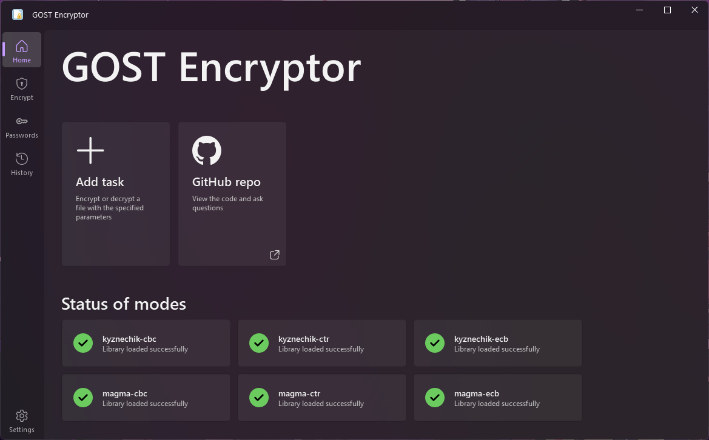
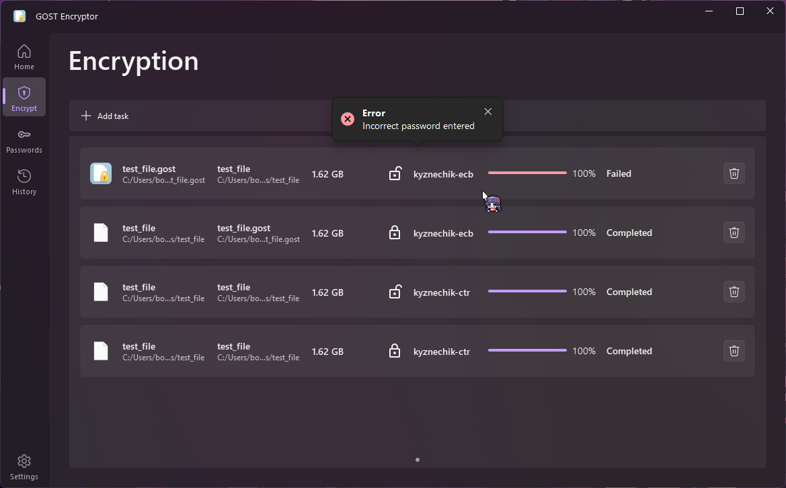
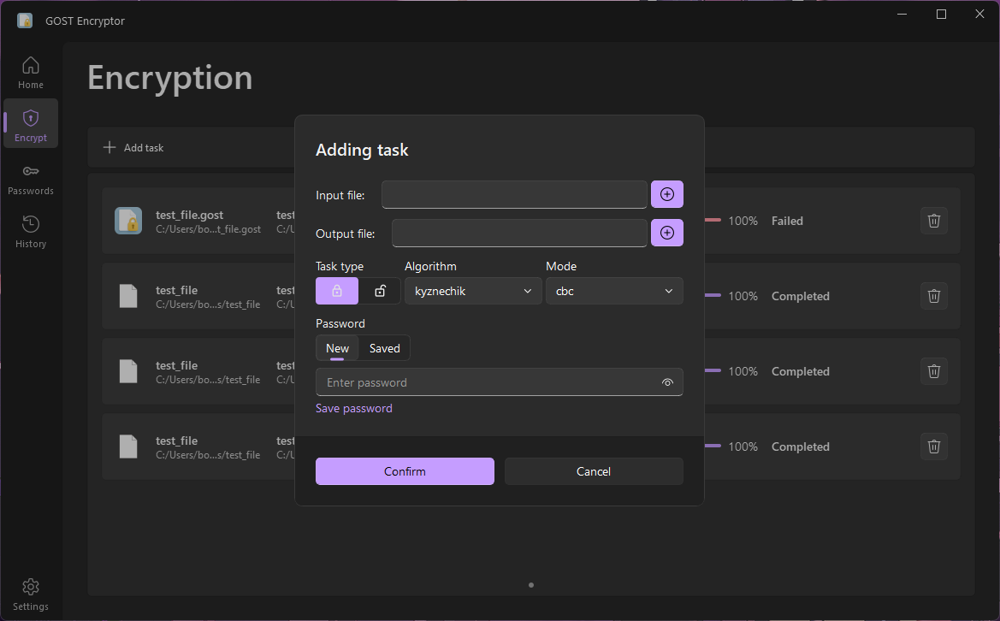
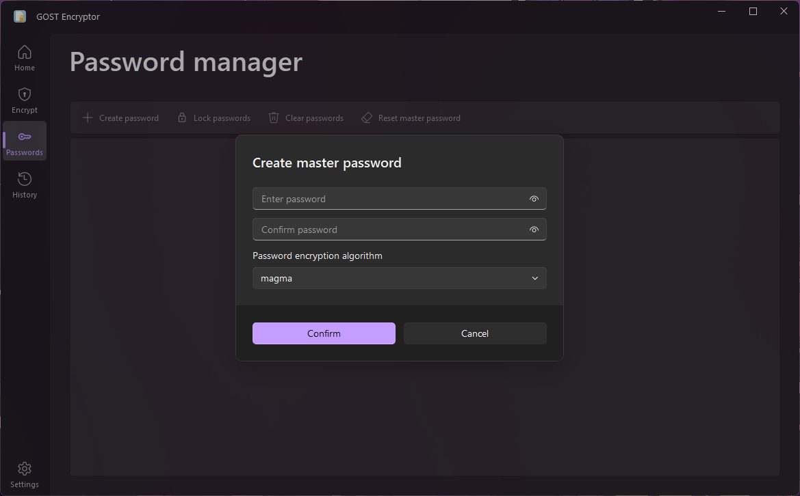
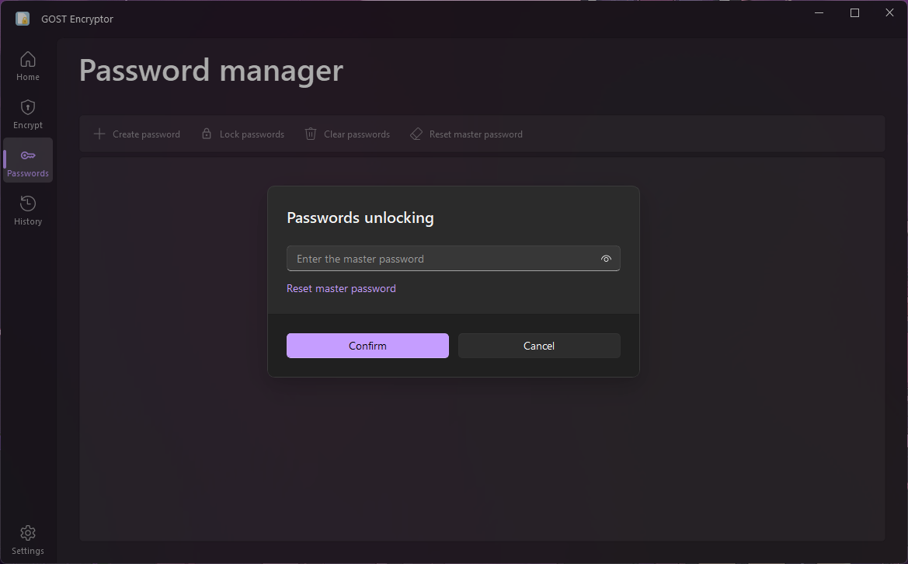
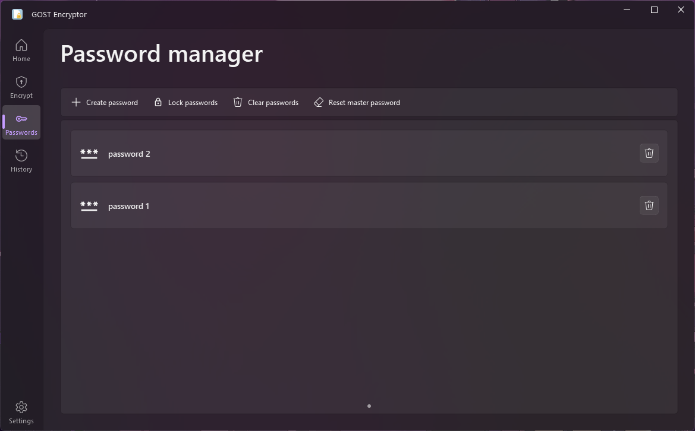
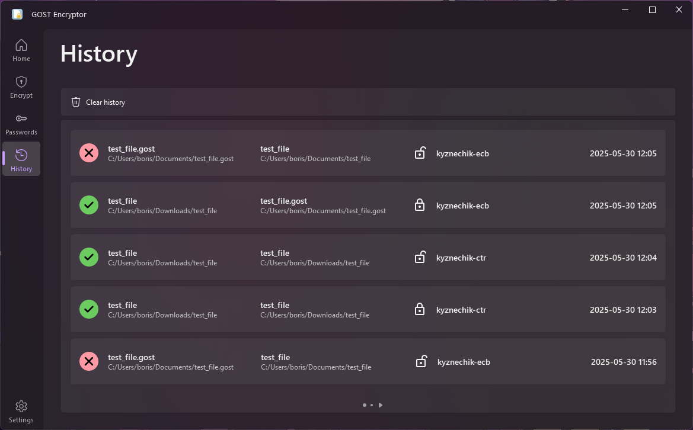
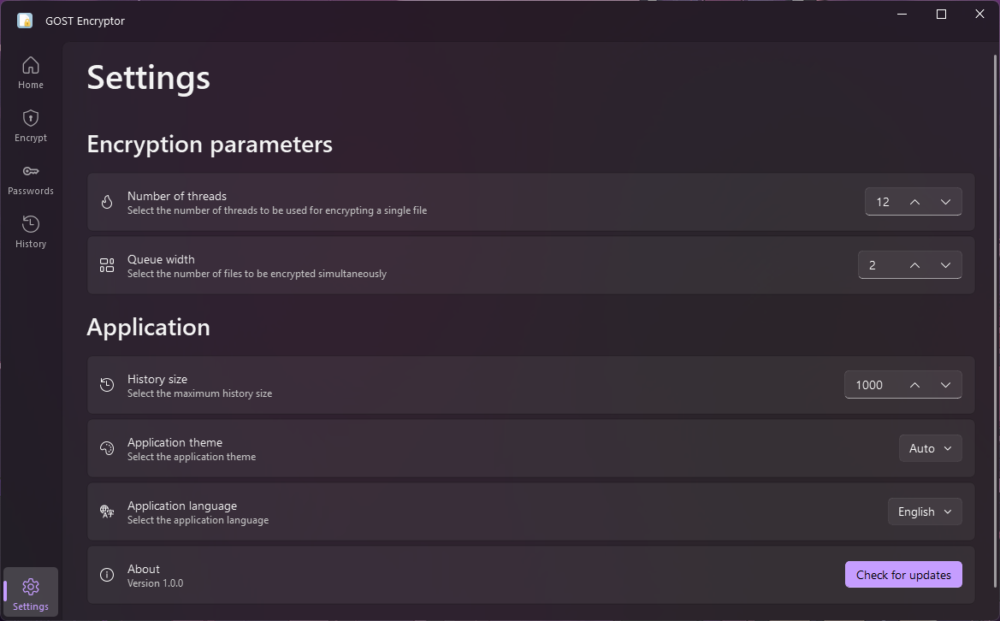

<h1 align="center">

  
GOST Encryptor  

</h1>

**GOST Encryptor** is an application for file encryption using Russian encryption algorithms and modes according to GOST
34.12 and GOST 34.13.

## Features :sparkles:

* File encryption using `Magma`and `Kuznyechik` algorithms
* Supported encryption modes:
    * ECB
    * CBC
    * CTR
* Password manager:
    * Save and reuse passwords for file encryption
    * Store passwords in encrypted form using a master key
* System integration:
    * `.gost` file association for encrypted files
    * Context menu encryption support in Windows Explorer

## Screenshots :camera:

|          |        |
|:-------------------------------------------:|:-------------------------------------------:|
|  |      |
|      |      |
|    |  |

## Installation :wrench:

1. Download the installer from the latest [release](https://github.com/LuTiFlekSSer/Encryption_app/releases/latest)
2. Run the downloaded file and follow the installation wizard
3. Launch the installed application

___

