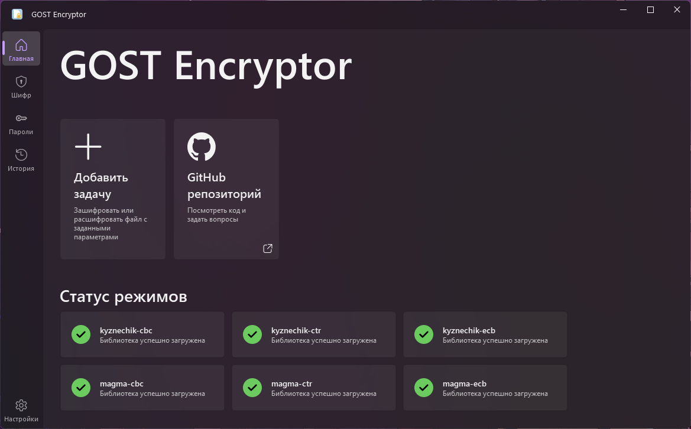
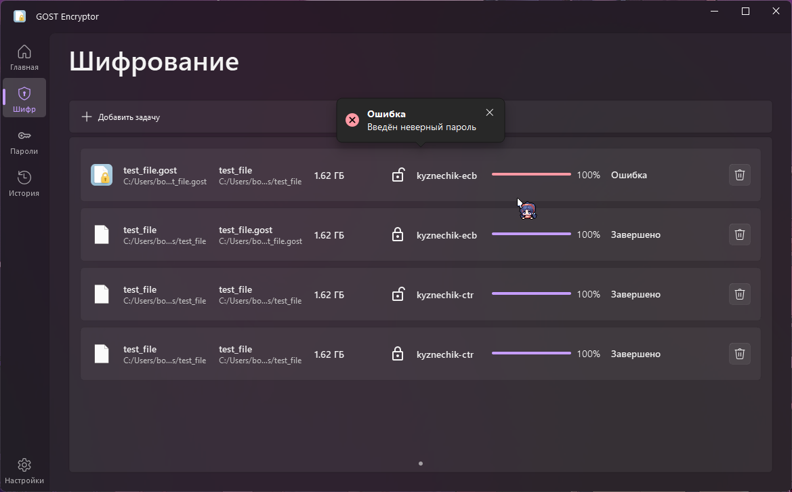
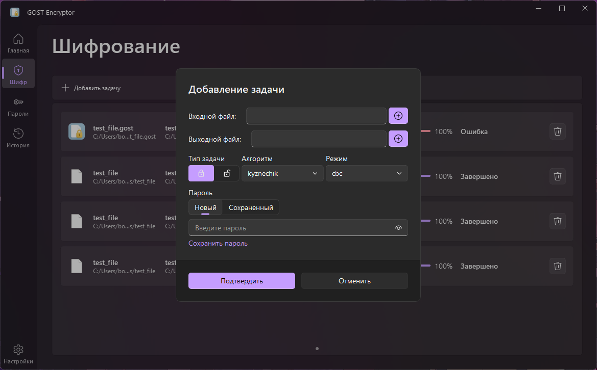
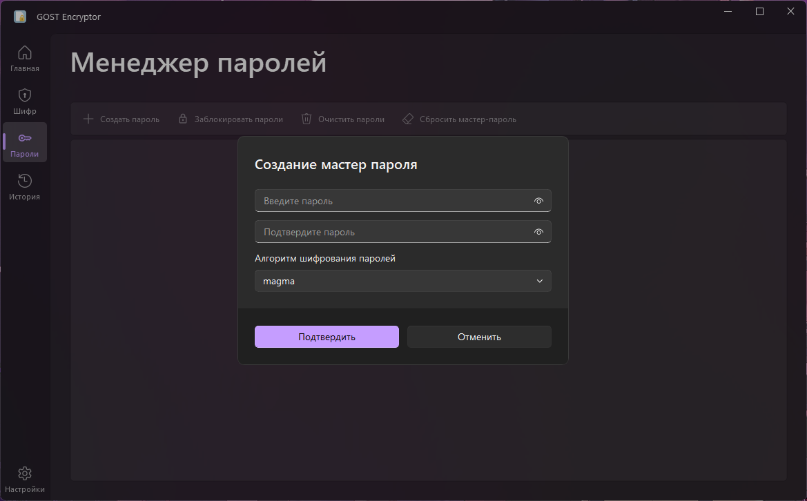
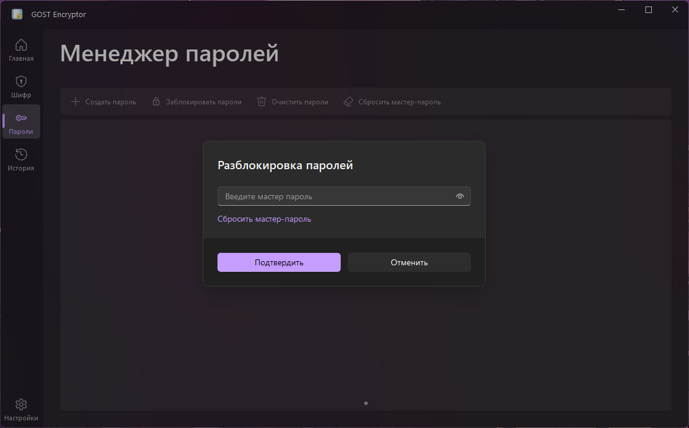
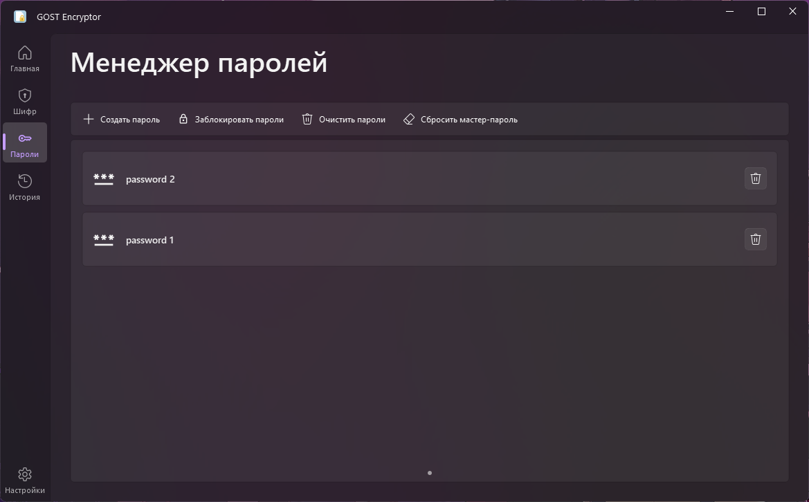
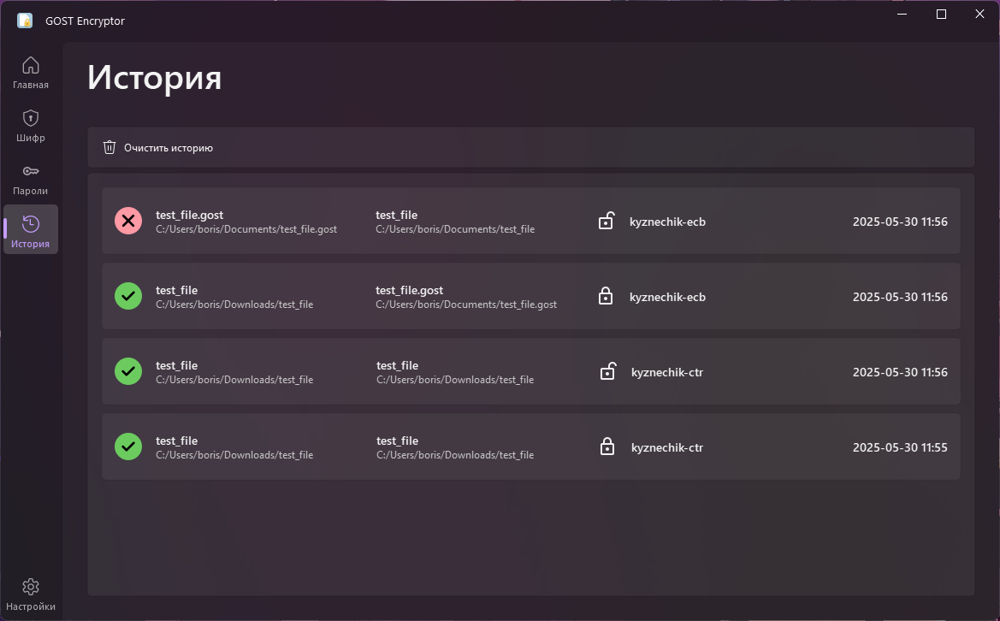
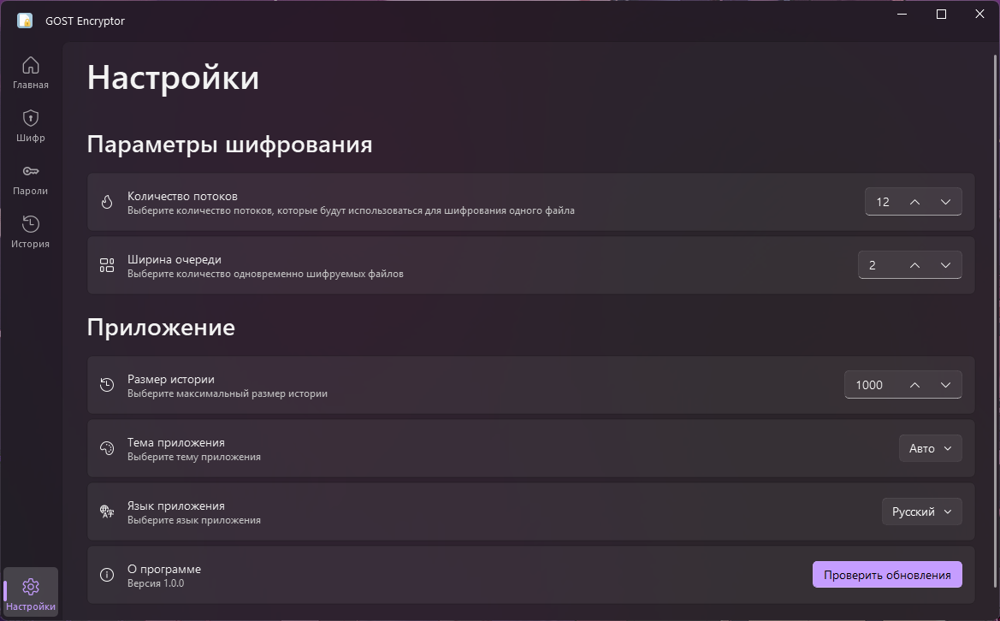

<h1 align="center">

  
GOST Encryptor

</h1>

**GOST Encryptor** - приложение для шифрования файлов с использованием Российских алгоритмов и
режимов в соответствии с ГОСТ 34.12 и ГОСТ 34.13.

## Возможности :sparkles:

* Шифрование файлов алгоритмами `Магма` и `Кузнечик`
* Поддержка режимов шифрования:
    * ECB
    * CBC
    * СTR
* Менеджер паролей:
    * Возможность использовать сохраняемые пароли для шифрования файлов
    * Хранение паролей в зашифрованном виде с использованием мастер-ключа
* Интеграция с системой:
    * Добавление ассоциации `.gost` для зашифрованных файлов
    * Возможность запуска шифрования из контекстного меню проводника

## Скриншоты :camera:

|          |        |
|:-------------------------------------------:|:-------------------------------------------:|
|  |      |
|      |      |
|    |  |

## Установка :wrench:

1. Необходимо скачать установщик из последнего [релиза](https://github.com/LuTiFlekSSer/Encryption_app/releases/latest)
2. Запустить скачанный файл и проследовать инструкциям мастера установки
3. Запустить установленную программу

___

